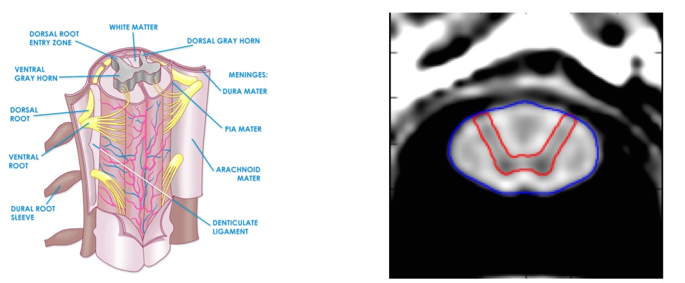
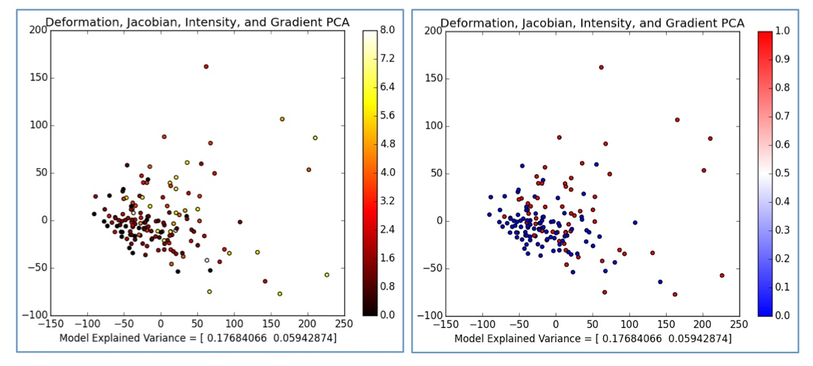
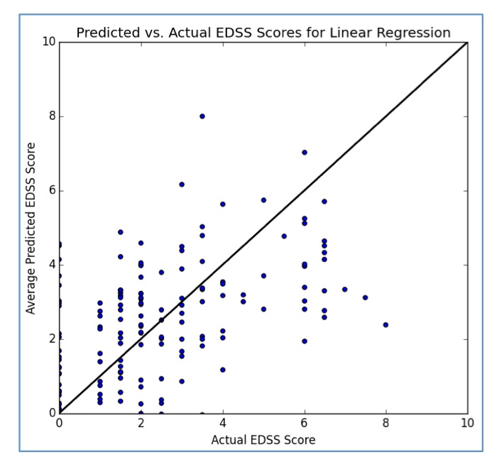
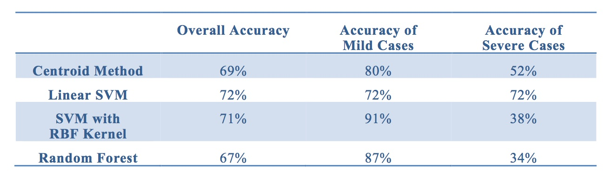
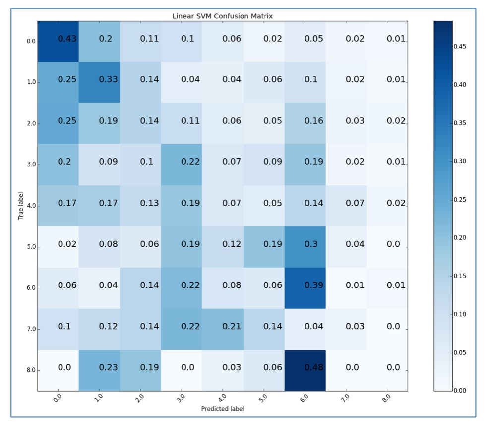

# SCMetrics
Exploration of Spinal Cord Metrics and Clinical Outcomes in Multiple Sclerosis

This work was done as part of CS289, UC Berkeley's Intro to Machine Learning class in Fall 2015.

(Sample data is not included since it includes patient information)

More information about this work can be found in this video:
https://www.youtube.com/watch?v=hBk6F4KtDC4&f

## Motivation

During the last few decades, researchers have struggled to find reliable biomarkers for multiple sclerosis (MS) that are accurately able to predict clinical outcomes. Until recently, spinal cord metrics were also poor contenders, due to the quality limitations of spinal cord imaging. With recent technological advances, we are now able to acquire better quality spinal cord images and capture these metrics more accurately. This study explores the potential of spinal cord metrics as biomarkers to predict clinical outcomes in multiple sclerosis using machine learning techniques.  The above figure shows a diagram of the spinal cord and an example of a spinal cord MRI image used in this analysis.

## Data Set and Feature Selection
The data set includes spinal cord images from 129 patients and 20 controls.  Deformation fields, jacobian determinants, intensity, and gradient metrics at each voxel were used as input features.  This data was used to predict disability level (mild vs severe MS) and also Expanded Disability Status Score (EDSS).

## Methods Used in Data Exploration

### Data Visualization of EDSS and Disability Level using Principal Component Analysis

Principal Components Colored by EDSS Score on left, Principal Components Colored by Disability Level on right

### Linear Regression Predictions of EDSS

### Classifications of Disability Level with Four Methods 
* Centroid Method
* SVM with Linear Kernel
* SVM with RBF Kernel
* Random Forest

### Multiclass Classification with Linear Support Vector Machine

## Conclusions
Linear SVM worked the best with an accuracy of 72%.  As expected, simpler linear methods work best for a smaller data set with many features 

